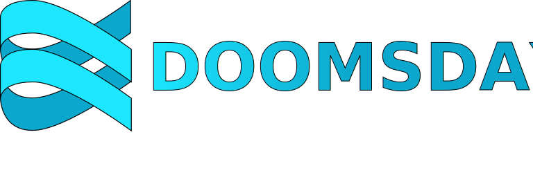

<p align="center"><a href=".docs/pics/DOOMSDAY.svg" target="_blank" rel="noopener noreferrer"></a></p>

<p align="center">


</p>

## Introduction

Doomsday is an emerging deep learning framework written in Scala.
Aimed at offering seamless numerical computations with the power of Scala, 
it leverages the Breeze library to provide high-speed numerical and linear algebraic operations. 
Please note that this library is still under development, and contributions or feedback are highly appreciated.

## Version Information

- **SDK**: 1.8
- **Scala Version**: 3.1.3
- **Breeze**: 2.1.0

## Dependencies

- [Breeze](https://github.com/scalanlp/breeze) - A library for numerical processing and scientific computing in Scala.

## Quick Start

1. **Clone the repository**:

```shell
git clone https://github.com/rxxuzi/doomsday.git
```

2. **Add Doomsday to your sbt project**:

In your `build.sbt` file, add the following dependency:

~~~sbt
libraryDependencies += "com.rxxuzi" %% "doomsday" % "latest.version"
~~~

*(Replace "latest.version" with the current version of Doomsday.)*

3. **Using the library**:

After setting up the dependency, you can start using Doomsday in your project:

~~~scala
import doomsday.core._
import doomsday.function._
import doomsday.models._
import doomsday.dataset._
import doomsday.optimizers._
~~~

You can now utilize all the functionalities provided by Doomsday.


## Features

## Documentation

For detailed usage instructions, troubleshooting, and more, check out our documentation in the [.docs folder.

## License

This project is licensed under the MIT License. For more details, see the [LICENSE](LICENSE) file.

